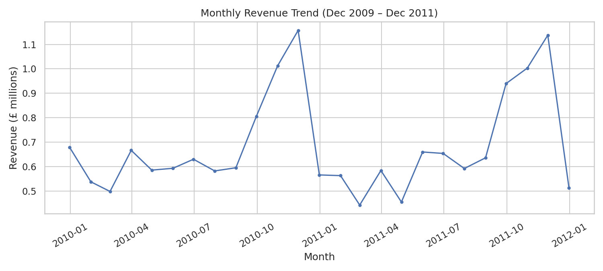
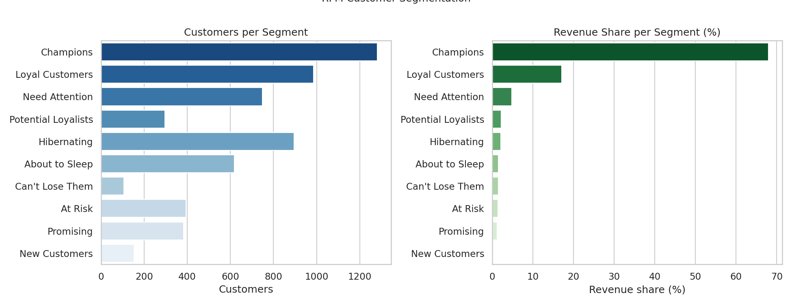
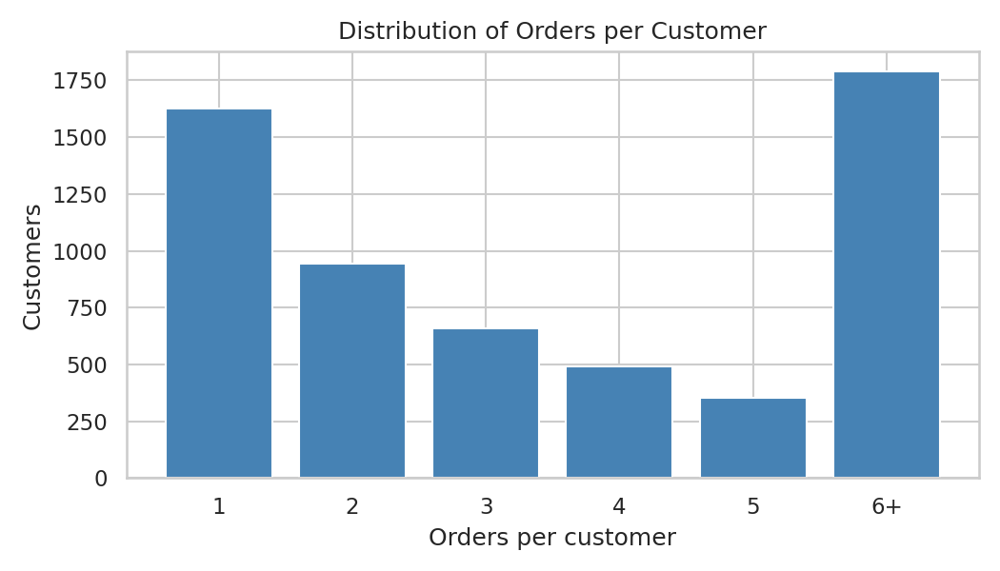
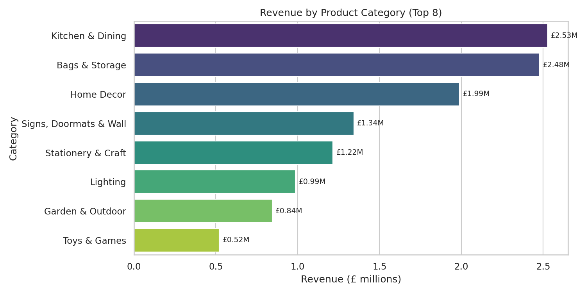
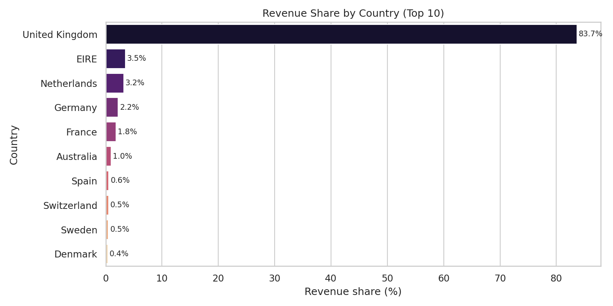

# E-Commerce Analytics: Customer Segmentation & Revenue Analysis

An end-to-end business analytics project on **776,872 online retail transactions**
(Dec 2009 – Dec 2011): revenue trends, RFM customer segmentation, repurchase
behavior, product-category performance, and geographic revenue concentration.

## Business Questions

1. How has revenue trended over time, and is there seasonality?
2. Which customer segments drive revenue, and who is at risk of churning?
3. How loyal are customers — what share repurchase, and how large is a typical basket?
4. Which product categories perform best?
5. How geographically concentrated is revenue?

## Dataset

**UCI Online Retail II** — transactions from a UK-based online giftware retailer
(https://archive.ics.uci.edu/dataset/502/online+retail+ii).

- 1,067,371 raw rows → **776,872** after cleaning
- 5,862 customers · 36,645 orders · 41 countries
- Columns: invoice no., stock code, description, quantity, invoice date,
  unit price, customer ID, country

## Methods

- **Cleaning:** removed duplicates (34,335), cancelled orders (19,104),
  rows with missing CustomerID (234,437), non-positive quantities/prices (70),
  and non-product adjustment rows such as postage/manual entries (2,553).
- **Revenue trend:** monthly aggregation with resampling.
- **RFM segmentation:** Recency / Frequency / Monetary scored into quintiles
  (1–5, 5 = best), then rule-based mapping to 10 labeled segments
  (Champions, Loyal Customers, At Risk, Hibernating, …).
- **Repurchase & basket metrics:** share of customers with 2+ orders,
  average order value (mean & median), items per order.
- **Product categories:** the dataset has no category column, so categories
  were derived via keyword mapping on product descriptions
  (covers 76% of revenue; e.g. "mug" → Kitchen & Dining).
- **Geography:** revenue share by country.

## Key Findings

- **£17.09M total revenue** across the two-year window; clear Q4 seasonality —
  peak month **November 2010 (£1.16M)**.
- **Revenue is highly concentrated:** the top 3 RFM segments
  (Champions, Loyal Customers, Need Attention) drive **89.9%** of revenue.
  Champions alone: 1,282 customers (21.9% of customers) generating
  **£11.62M (68.0%)** of revenue.
- **Strong loyalty:** **72.3%** of customers placed 2 or more orders.
- **Basket metrics:** average order value **£466.25** (median £302.57),
  averaging **286.5 items per order** — a wholesale-like buying pattern.
- **Top product category:** Kitchen & Dining (**£2.53M, 14.8%** of revenue),
  followed by Bags & Storage (£2.48M, 14.5%) and Home Decor (£1.99M, 11.6%).
- **Geographic concentration risk:** the **United Kingdom accounts for 83.7%**
  of revenue (£14.29M); the next largest market, Ireland, is only 3.5% —
  international expansion is a clear growth lever.
- **Watch list:** 394 At-Risk and 896 Hibernating customers represent
  recoverable revenue if re-engaged.

## Visuals







## How to Run

```bash
# 1. Download the dataset into data/
#    https://archive.ics.uci.edu/static/public/502/online+retail+ii.zip
#    and unzip it so data/online_retail_II.xlsx exists.

# 2. Install dependencies
pip install pandas numpy matplotlib seaborn openpyxl

# 3. Run the analysis
python analysis.py
```

Figures are written to `outputs/` and key findings are printed to stdout.

## Tech Stack

Python · pandas · NumPy · matplotlib · seaborn
